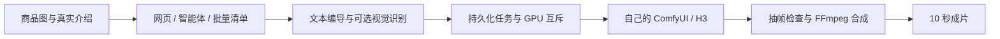

# 一句话生成带货视频 · AI Director

**把自己的 ComfyUI 视频工作流变成可复用的商品视频生产工具。** 上传商品图、填写真实介绍，生成两镜头、10 秒 MP4，自动配中文字幕、可选价格、原创程序配乐与 AI 标识。

支持本地网页、智能体 HTTP 接口和串行商品批量任务。视频计算由你配置的 ComfyUI / MiniMax H3 工作流执行；文本编导可接 DeepSeek 或其他 OpenAI 兼容服务，包括本地服务。本项目不提供模型权重、共享 GPU 或公共在线生成服务。

## 已实现

- **完整成片**：商品参考图、可选的已授权人物照、两镜脚本、参考上一镜收尾片段、抽帧检查与 FFmpeg 合成。
- **横竖版与两档尺寸**：432×768 / 720×1280，以及对应横版；10 秒、24fps。耗时取决于模型、显存、负载与重拍，页面时间仅供参考。
- **可配置工作流**：替换 ComfyUI API JSON，用节点角色映射适配不同编号。保留 H3 输入契约，不宣称兼容所有视频模型。
- **自动化与批量**：独立 Bearer 令牌、幂等提交、受保护的状态与下载接口、逐个制作、断点恢复、下载校验。
- **安装自检**：检查 Python、FFmpeg、中文字体、工作流；可选只读探测 ComfyUI 节点、模型选择器和队列，不生成视频、不调用 LLM。
- **安全发布**：配置模板、源码白名单打包、密钥与个人信息扫描、Git 历史检查、CI 测试与依赖审计。



## 快速开始

支持 macOS、Linux；Windows 使用 WSL2。需要 Python 3.11+、可用的 H3 Ref2VA ComfyUI 服务及文本编导模型。视觉模型可选：未配置时不进行图像识别和有效视觉质检。

```bash
git clone https://github.com/hylovelyb970623-maker/one-sentence-product-video.git
cd one-sentence-product-video
python3.11 -m venv m0/.venv
m0/.venv/bin/python -m pip install -r m0/requirements.txt
cp m0/.env.example m0/.env
chmod 600 m0/.env
```

只在本机编辑 `m0/.env`。默认 ComfyUI 为 `http://127.0.0.1:8188`；填写 `DEEPSEEK_API_KEY`，或配置 `LLM_BASE_URL`、`LLM_MODEL`、`LLM_API_KEY` 接入其他文本服务。本地免认证兼容服务可留空 Key，模型需支持 JSON 对象响应，模型 ID 以服务提供方为准。

可选 `VISION_BASE_URL`、`VISION_MODEL`、`VISION_API_KEY` 用于看图和质检。云端文本服务会收到商品事实；云端视觉服务还会收到商品图与质检抽帧；素材会发到配置的 ComfyUI。**本地网页不等于所有数据都留在本机。**

Linux 安装中文字体（例如 `fonts-noto-cjk`），或指定 `CHINESE_FONT`。FFmpeg 需要 5.1+，优先系统程序，否则使用 `imageio-ffmpeg` 随包提供的二进制；合成显式固定为每镜 120 帧、成片 240 帧和 24 fps。

```bash
m0/.venv/bin/python m0/doctor.py
m0/.venv/bin/python m0/doctor.py --online
bash scripts/start.sh
```

打开 **http://127.0.0.1:8666**。macOS 也可双击 `m0/启动界面.command`。启动器不停止已有服务或 GPU 任务；测试版可设置 `DIRECTOR_PORT=8667`。当前仅支持单用户、单个 uvicorn worker。

## 接入自己的 ComfyUI

先在自己的 ComfyUI 验证工作流，再导出 **API 格式** JSON 并设置节点映射，见 [工作流接入](m0/workflows/README.md)。自检不等于真实 GPU 生成验收。

远程服务推荐 SSH 隧道：清空 `COMFYUI_HOST`，配置 `SSH_HOST`、`SSH_USER` 和密钥。SSH 只接受可信 known_hosts，首次连接需自行核实主机指纹。远程直连应使用可信 HTTPS，不在明文公网 HTTP 上传认证信息与素材。

## 可选视频 API 适配

保留后续提交新增的 `VIDEO_ENGINE=h3api` 实验适配路径，默认仍为 ComfyUI。选择 API 路径时，填写自己的 `H3_API_KEY`、`H3_API_MODEL` 和服务路径；请求字段与具体模型支持情况需要对照提供方文档验证，本项目的 mock 测试不代表该云端模型已验证可用。

API 调用只接受 HTTPS。下载视频使用无认证信息的独立连接，不向 CDN 发送模型 Key；跨主机下载须将核实过的域名加入 `H3_API_DOWNLOAD_HOSTS`，多个域名用逗号分隔。不接受下载重定向、未知主机或不安全的任务文件名。

任务保存其实际引擎，恢复时逐个检查对应平台的任务状态。API 提交结果不明且没有任务 ID 时，不能把平台“无全局队列接口”当作空闲，必须先人工核实；不会自动再次消费生成额度。

## 批量与智能体

设置独立随机 `DIRECTOR_AGENT_TOKEN`（至少 32 字符），在本项目服务空闲时重启生效；未设置则接口关闭，管理员密码不兼作 API 令牌。云端 Coze / Dify / GPTs 不能直接访问本机回环地址；本版面向同机调用方，不应直接反向代理到公网。

复制 `examples/batch.example.json` 为自己的清单，放入自己授权的商品图；每个规格使用不同 `id`：

```bash
m0/.venv/bin/python m0/batch.py examples/batch.example.json
m0/.venv/bin/python m0/batch.py examples/batch.example.json --submit
```

第一条只校验；第二条才提交真实模型。中断后使用相同清单和状态文件重跑，保留 `batch-state.local.json`。默认串行，失败或待确认时停止。详见 [接口与恢复约定](docs/automation.md)。

## 管理与质量边界

`/admin` 使用 HTTP Basic，用户名 `admin`。`DIRECTOR_ADMIN_PASSWORD` 最少 16 字符；未配置时随机密码保存在本机 `m0/.private/admin-password`。不要分享私密配置、任务目录或日志。任务与素材在 `m0/out/jobs/`，普通页面凭不可枚举的任务 ID 查看成片，不提供跨租户授权。

重启不会自动重发或取消远端任务；中断进入待确认，管理员核对远端后解除阻塞。图像规范化清除元数据；诊断落盘前脱敏。公网认证、团队权限和素材保留策略尚未实现。

视觉质检目前偏饮品场景，最多重拍一次；现有逻辑不能保证拒绝第二次仍不合格的镜头。AI 可能改变包装或文字；视觉特征推断、商品外观、文案、价格与肖像授权需发布前人工复核。AI 标识不代表监管认证。旧 `m0/cli.py` 是含显式 mock/replay 的研发演示管线，不作为正式成片工具。

## 测试与安全发布

```bash
m0/.venv/bin/python -m pip install -r m0/requirements-dev.txt
m0/.venv/bin/python -m pytest m0/tests -q
m0/.venv/bin/python scripts/security_check.py
m0/.venv/bin/python scripts/security_check.py --git --history
m0/.venv/bin/python -m pip_audit -r m0/requirements.txt
m0/.venv/bin/python scripts/package_release.py --output release/source.zip
```

测试隔离真实配置、密码和输出，拦截 requests / httpx 的外部服务调用；媒体测试使用合成色块验证真实编码、字幕、配乐与时长。发布包只包含 `release-manifest.json` 白名单源码和 SHA-256 清单，不含运行数据、原始 UI 工作流导出或模型权重。

扫描只报告规则与位置，不打印敏感值；规则扫描不能代替人工隐私审核。已泄露凭据必须轮换，重写分支不能保证旧提交 URL、缓存与已有克隆已清除，见 [SECURITY.md](SECURITY.md)。

代码沿用仓库 MIT 许可证；模型、插件、字体与媒体权利独立，见 [THIRD_PARTY.md](THIRD_PARTY.md)。另见 [贡献指南](CONTRIBUTING.md) 和 [开源路线](docs/open-source-roadmap.md)。
